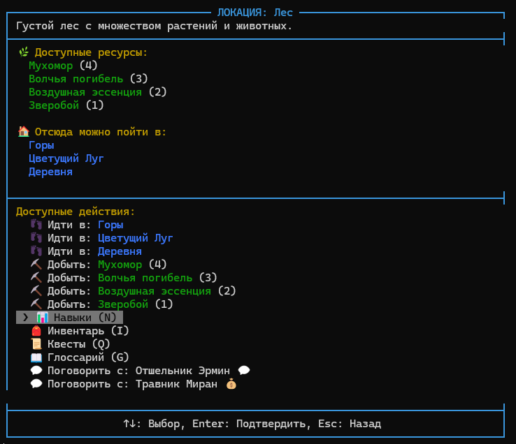

# RPG - Текстовое Ролевое Приключение

RPG представляет собой консольную ролевую игру с текстовым интерфейсом, написанную на Python. Игра предлагает сказочный мир с различными локациями, персонажами, квестами и системой сбора ресурсов. Интерфейс игры полностью текстовый с использованием цветов и Unicode-символов для улучшения пользовательского опыта.



## Особенности игры

- **Исследование мира**: Исследуйте различные локации, начиная от лесов и гор до деревень и пещер.
- **Сбор ресурсов**: Собирайте полезные материалы, такие как травы, руды и магические эссенции.
- **Система квестов**: Выполняйте задания от NPC для получения наград и открытия новых возможностей.
- **NPC и диалоги**: Взаимодействуйте с различными персонажами, такими как торговцы, отшельники и деревенские жители.
- **Торговля**: Продавайте собранные ресурсы и покупайте новые предметы у торговцев.
- **Система навыков**: Развивайте свои навыки в травничестве, горном деле и элементализме.
- **Глоссарий**: Отслеживайте информацию о найденных ресурсах и встреченных персонажах.
- **Интуитивное управление**: Простое управление с помощью стрелок и горячих клавиш.

## Требования

- Python 3.6 или выше
- pip (менеджер пакетов Python)

## Установка

1. Клонируйте репозиторий:

   ```bash
   git clone https://github.com/yourusername/RPG.git
   cd RPG
   ```

2. Создайте виртуальное окружение (рекомендуется):

   ```bash
   python -m venv .venv
   ```

3. Активируйте виртуальное окружение:

   Windows:

   ```bash
   .venv\Scripts\activate
   ```

   Linux/Mac:

   ```bash
   source .venv/bin/activate
   ```

4. Установите необходимые зависимости:
   ```bash
   pip install -r requirements.txt
   ```

## Запуск игры

После установки запустите игру командой:

```bash
python -m main
```

## Управление

- **Стрелки вверх/вниз (↑/↓)** - Перемещение между пунктами меню
- **Enter** - Подтверждение выбора
- **Esc** - Возврат/Выход из текущего меню
- **I** - Открыть инвентарь
- **N** - Открыть меню навыков
- **Q** - Открыть журнал квестов
- **G** - Открыть глоссарий

## Структура проекта

```
RPG/
├── main.py                 # Точка входа в игру
├── requirements.txt        # Зависимости проекта
├── resources/              # Игровые ресурсы и данные
│   ├── items/              # Предметы
│   ├── npcs/               # NPC (торговцы, квестодатели)
│   ├── places/             # Локации
│   ├── quests/             # Квесты
│   └── skills/             # Навыки
└── src/                    # Исходный код игры
    ├── Game.py             # Основной класс игры
    ├── PreLoader.py        # Система предзагрузки ресурсов
    ├── loaders/            # Загрузчики игровых данных
    ├── models/             # Модели данных
    │   ├── Location.py     # Локации
    │   ├── Player.py       # Игрок
    │   ├── inventory/      # Система инвентаря
    │   ├── npc/            # Система NPC
    │   ├── quests/         # Система квестов
    │   └── skills/         # Система навыков
    ├── ui/                 # Пользовательский интерфейс
    │   ├── GameMenu.py     # Основное игровое меню
    │   └── screens/        # Экраны игры
    └── utils/              # Утилиты
        └── Logger.py       # Система логирования
```

## Основные механики

### Локации и перемещение

Мир игры разделен на различные локации, каждая со своими ресурсами и NPC. Перемещаться между локациями можно, выбрав соответствующий пункт в меню действий.

### Сбор ресурсов

В каждой локации можно собирать различные ресурсы, которые возобновляются со временем. Некоторые ресурсы требуют определенного уровня навыков для сбора.

### Навыки

Игрок может развивать различные навыки, собирая соответствующие ресурсы:

- **Травничество** - сбор растений и грибов
- **Горное дело** - добыча руд и минералов
- **Элементализм** - сбор магических эссенций

### Квесты

Квесты можно получить у NPC в различных локациях. Они включают задания на сбор ресурсов, посещение определенных мест или разговор с другими персонажами.

### Торговля

У торговцев можно продавать собранные ресурсы и покупать полезные предметы. Цены варьируются в зависимости от типа и редкости предметов.

### Глоссарий

В глоссарии хранится информация о найденных ресурсах и встреченных NPC. Он также позволяет отслеживать выбранные цели на карте.

## Разработка и вклад

Если вы хотите внести свой вклад в проект, пожалуйста, следуйте этим шагам:

1. Создайте форк репозитория
2. Создайте ветку для вашей функции (`git checkout -b feature/amazing-feature`)
3. Сделайте коммит ваших изменений (`git commit -m 'Add amazing feature'`)
4. Отправьте ветку в ваш форк (`git push origin feature/amazing-feature`)
5. Откройте Pull Request

## Лицензия

Этот проект распространяется под лицензией MIT. См. файл `LICENSE` для получения подробной информации.

## Контакты

Если у вас есть вопросы или предложения, пожалуйста, создайте issue в репозитории или свяжитесь с разработчиком напрямую.
